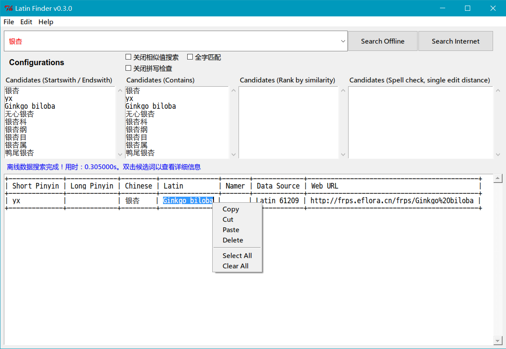

LatinSearch
===========

植物拉丁名搜索（LatinSearch）

截图
---

介绍
----

根据植物拼音缩写、拼音、中文名称或者拉丁名进行本地或者网络模糊搜索，快速获得其他信息。

得到候选词后，**双击** 候选词，将得到详细信息。如果没有匹配，将会使用糢糊搜索。

下载
---

- 对于 Windows 用户，需要先下载安装 [Python](https://www.python.org/downloads/). Linux 或者 Mac OSX 系统已自带。
- 下载最新版本的 LatinSearch 程序文件：[点击这里下载](https://raw.githubusercontent.com/zxjsdp/LatinSearch/master/LatinSearch.zip)。
- 解压缩。
- 双击运行：`LatinSearch.pyw` 或者 `latinsearch.py`。

使用方法
-------

1. 使用拼音首字母搜索。例如搜索 “eqxlm”，将会得到 “二球悬铃木” 及其他悬铃木相关的结果。
2. 使用拼音全称搜索。例如搜索 “erqiuxuanlingmu”，将会得到 “二球悬铃木” 及其他悬铃木相关的结果。
3. 使用中文搜索。例如搜索 “悬铃木”，将会得到 “二球悬铃木”， “三球悬铃木” 等相关搜索结果。
4. 使用拉丁名搜索。例如搜索 “Platanus × acerifolia”，将会得到 “二球悬铃木” 相关的结果。

搜索策略介绍
----------

    +---+------------------------+
    | 1 | 候选词以查询词开始或结尾
    |---+------------------------+
    | 2 | 候选词包含查询词
    |---+------------------------+
    | 3 | 根据相似性进行糢糊搜索
    |---+------------------------+
    | 4 | 拼写检查（编辑距离为 1)
    +---+------------------------+

